# 一、shell入门

编写规范：

代码规范：

​    `\#!/bin/bash`            [指定告知系统当前这个脚本要使用的shell解释器]

​    `Shell`相关指令

 

文件命名规范：

​    `文件名.sh`              `.sh`是`linux`下`bash shell` 的默认后缀

 

使用流程：

①创建`.sh`文件          `touch/vim`

②编写`shell`代码

③执行`shell`脚本        **脚本必须得有执行权限**


案例1：创建test.sh，实现第一个shell脚本程序，输出hello world.

输出命令：#echo 123

注意：输出的内容如果包含字母和符号（不包含变量），则需要用引号包括起来。如果是纯数字可以包也可以不包。

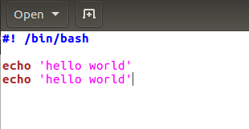


`Shell`脚本分为简单的写法（简单命令的堆积）和复杂写法（程序的设计）


# 二、shell进阶


## 1、变量（重点）

### 1.1、变量的含义

a. 什么是量

量就是数据.

b. 什么是变量

数据可以发生改变就是变量.

**在一个脚本周期内,****其值可以发生改变的量就是变量.**

c. 什么叫做一个脚本周期

一个脚本周期我们可以简单的理解为当前的`shell`文件

 

变量是`shell`中不可或缺的一部分，也是**最基础、最重要**的组成部分。

### 1.2、变量的定义与使用（重点）

变量，先定义后使用。

 

**定义形如：class_name="yunwe "**

**使用形如：echo $class_name**

 

变量就是由2部分组成,一个是**变量名（左边）**，另外一部分是**变量的值（右边）**

变量名和变量值是什么关系??

变量名和变量值是**使用和被使用**关系; 我们的变量名来使用变量值;

 

在使用变量的时候一定需要在变量名前面添加一个$符号，该要求在其他语言中也存在的（例如php）。


**变量名的规范：**

注意，**变量名后面的等号左右不能有空格**，这可能和你熟悉的所有编程语言都不一样。同时，变量名的命名须遵循如下规则：

命名只能使用英文字母，数字和下划线，首个字符不能以数字开头。

中间不能有空格，可以使用下划线“_”。

不能使用标点符号。

不能使用bash里的关键字（可用help命令查看保留关键字）。


案例1：使用变量改写入门脚本中的第1个shell脚本。

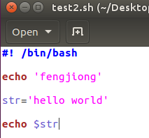


**关于单双引号的问题：**

**双引号能够识别变量，双引号能够实现转义（类似于“\*****”）  双引号能够实现转义 “\*”。

**单引号是不能识别变量，只会原样输出，单引号是不能转义的**


案例2：定义一个变量，输出当前时间，要求格式为“年-月-日 时:分:秒”。


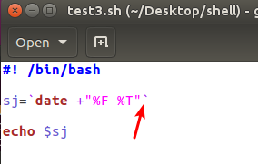


**注意：反引号（esc****键下方的那个键），当在脚本中需要执行一些指令并且将执行的结果赋给变量的时候需要使用“反引号”。**

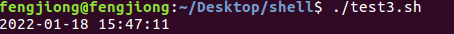


### 1.3、只读变量（了解）

语法：readonly 变量名

 

案例：定义变量a并且其值为10，随后设置其为只读变量，再去尝试重新赋值

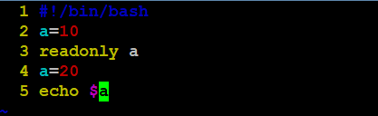

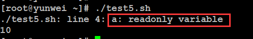


### 1.4、接收用户输入（重点）

**语法：read -p** **提示信息**  **变量名**

 

案例：编写一个脚本test6.sh，要求执行之后提示用户输入文件的名称（路径），然后自动为用户创建该文件


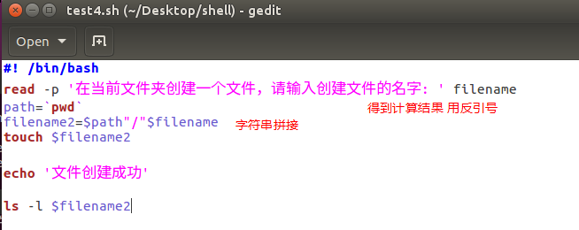


### 1.5、删除变量（了解）

语法：unset 变量名

 

案例：定义变量b=20，再输出b的值，随后删除b，最后再输出下b

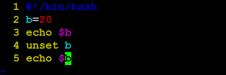

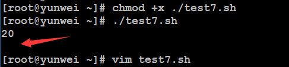


## 2、条件判断语句

老婆给当程序员的老公打电话：**下班顺路买一斤包子带回来，如果看到卖西瓜的，买一个**。当晚，程序员老公手捧一个包子进了家门…老婆怒道：你怎么就买了一个包子？！老公答曰：因为看到了卖西瓜的。


**上述1****和2****下面的条件汉字描述称之为“伪代码”，也是属于条件表达式的语法。**

 

语法1（一个条件）：

```shell
if condition

then

  command1 

  command2

  ...

fi				(fi 表示闭合，if 条件结束)
```

 

单行写法（一般在**命令行中执行**的时候）：if [ condition ]; then command; fi


语法2（两个条件）：


```shell
if condition

then

  command1 

  command2

  ...

else

  command

fi
```


语法3（多个条件）：		

```shell
if condition1   #if 后面需要加个`then`

then

  command1

elif condition2 

then

  command2

else

  commandN

fi
```


## 3、运算符

在shell中，运算符和其他编程脚本语言一样，常见的有算数运算符、关系运算符、

逻辑运算符、字符串运算符、**文件测试运算符**等

### 3.1、算数运算符

下表列出了常用的算术运算符，假定变量 a 为 10，变量 b 为 20：


| **运算符** | **说明**                                        | **举例**                         |
| ---------- | ----------------------------------------------- | -------------------------------- |
| +          | 加法                                            | `expr  $a + $b` 结果为 30。      |
| -          | 减法                                            | `expr  $a - $b` 结果为 -10。     |
| *          | 乘法                                            | `expr  $a \* $b` 结果为  200。   |
| /          | 除法                                            | `expr  $b / $a` 结果为 2。       |
| %          | 取余                                            | `expr  $b % $a` 结果为 0。       |
| =          | 赋值                                            | a=$b 将把变量 b 的值赋给 a。     |
| ==         | 相等。用于比较两个数字，相同则返回 true（真）。 | [ $a  == $b ] 返回 false（假）。 |
| !=         | 不相等。用于比较两个数字，不相同则返回 true。   | [ $a  != $b ] 返回 true。        |


**注意：**条件表达式要放在**方括号**之间，**并且要有空格**，例如: `[$a==$b]`是错误的，必须写成 **`[ $a == $b ]`**。


除了变量的赋值不需要空格之外，运算符，`if` 判断语句都需要加括号


原生bash不支持简单的数学运算，但是可以通过其他命令来实现，例如 `awk` 和 `expr`，`expr` 最常用。

`expr` 是一款表达式计算工具，使用它能完成表达式的求值操作。

例如，两个数相加(注意使用的是反引号 ` 而不是单引号 ')：

\

```shell
#!/bin/bash

val=`expr 2 + 2`

echo "两数之和为 : $val"
```

 

两点注意：

表达式和运算符之间要有**空格**，例如 `2+2` 是不对的，必须写成 `2 + 2`，这与我们熟悉的大多数编程语言不一样。

完整的表达式要被  **反引号**  包含，注意这个字符不是常用的单引号，在 `Esc` 键下边。


```shell
#! /bin/bash

a=20
b=10

echo $a
echo $b

echo 'a + b = ' `expr $a + $b`
echo 'a - b = ' `expr $a - $b`
echo 'a * b = ' `expr $a \* $b`   # 转义表示 两个数字 相乘
echo 'a / b = ' `expr $a / $b`
echo 'a % b = ' `expr $a % $b`
```


```shell
if [ $a == $b ]		# 注意前后都要加空格 这样才正确
then
	echo '两个数字相等 a== b'
else
	echo '两个数字不相等 a！= b'
fi

if [ $a != $b ]
then
	echo '两个数字不相等 a！= b'
else
	echo '两个数字相等 a== b'
fi
```


### 3.2、关系运算符

**关系运算符只支持数字，不支持字符串，除非字符串的值是数字**。

下表列出了常用的关系运算符，假定变量 a 为 10，变量 b 为 20：


| **运算符** | **说明**                                                  | **举例**                    |
| ---------- | --------------------------------------------------------- | --------------------------- |
| -eq        | 检测**两个数是否相等**，相等返回 true。                   | [ $a  -eq $b ] 返回 false。 |
| -ne        | 检测**两个数是否相等**，不相等返回 true。                 | [ $a  -ne $b ] 返回 true。  |
| -gt        | 检测左边的数**是否大于**右边的，如果是，则返回 true。     | [ $a  -gt $b ] 返回 false。 |
| -lt        | 检测左边的数**是否小于**右边的，如果是，则返回 true。     | [ $a  -lt $b ] 返回 true。  |
| -ge        | 检测左边的数**是否大于等于**右边的，如果是，则返回 true。 | [ $a  -ge $b ] 返回 false。 |
| -le        | 检测左边的数**是否小于等于**右边的，如果是，则返回 true。 | [ $a  -le $b ] 返回 true。  |

- -eq：equal
- -ne：not equal
- -gt：great than
- -lt：less than
- -ge：great than or equal
- -le：less than or equal


```shell
if [ $a -gt $b ]
then
	echo 'a ＞ b'
else
	echo 'a ＜ b'
fi

echo ''

if [ $a -lt $b ]
then
	echo 'a ＜ b'
else
	echo 'a ＞ b'
fi

echo ''

if [ $a -ge $b ]
then
	echo 'a ＞＝ b'
else
	echo 'a ＜＝ b'
fi

echo ''

if [ $a -le $b ]
then
	echo 'a ＜＝ b'
else
	echo 'a ＞＝ b'
fi
```

**课堂作业：**

写一个脚本，判断当前输入的用户是否存在。如果存在则提示“用户存在”否则提示“用户不存在”。


### 3.3、逻辑运算符

下表列出了常用的布尔运算符，假定变量 a 为 10，变量 b 为 20：


| **运算符** | **说明**                                                     |                 **举例**                  |
| :--------- | ------------------------------------------------------------ | :---------------------------------------: |
| !          | 非运算，表达式为 true 则返回 false，否则返回 true。          |         [ !  false ] 返回 true。          |
| -o         | 或（或者）运算，**有一个表达式为** **true** **则返回** **true**。 | [ $a  -lt 20 -o $b -gt 100 ] 返回 true。  |
| -a         | 与（并且）运算，**两个表达式都为** **true** 才返回 true。    | [ $a  -lt 20 -a $b -gt 100 ] 返回 false。 |

**或运算：一个为真即为真，全部为假才是假**

**与运算：一个为假即为假，全部为真才是真**


```shell
#! /bin/bash

a=20
b=50

if [ !false ]
then
	echo 'true'
fi

echo ''

if [ $a -ge 20 -o $b -gt 100 ]
then
	echo 'true'
else
	echo 'false'
fi

echo ''

if [ $a -ge 20 -a $b -gt 100 ]
then
	echo 'true'
else
	echo 'false'
fi
```


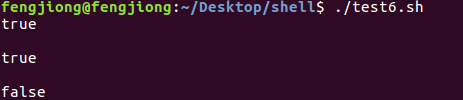


### 3.4、字符串运算符

下表列出了常用的字符串运算符，假定变量 a 为 "abc"，变量 b 为 "efg"：


| **运算符** | **说明**                                  | **举例**                  |
| ---------- | ----------------------------------------- | ------------------------- |
| =          | 检测两个字符串是否相等，相等返回 true。   | [ $a =  $b ] 返回 false。 |
| !=         | 检测两个字符串是否相等，不相等返回 true。 | [ $a  != $b ] 返回 true。 |
| -z         | 检测字符串长度是否为0，为0返回 true。     | [ -z  $a ] 返回 false。   |
| -n         | 检测字符串长度是否为0，不为0返回 true。   | [ -n  $a ] 返回 true。    |
| str        | 检测字符串是否为空，不为空返回 true。     | [ $a ]  返回 true。       |

```shell
#! /bin/bash

s1='abc'
s2='efg'

echo "s1 = $s1"
echo "s2 = $s2"

if [ -z $s1 ]
then
	echo 'true'
else
	echo 'false'
fi

echo ''

if [ -n $s1 ]
then
	echo 'true'
else
	echo 'false'
fi

echo ''

if [ $s1 ]
then
	echo 'true'
else
	echo 'false'
fi
```


### 3.5、文件测试运算符（重点）

文件测试运算符用于检测 `Unix/Linux` 文件的各种属性。

属性检测描述如下：


| **操作符** | **说明**                                                     | **举例**                   |
| ---------- | ------------------------------------------------------------ | -------------------------- |
| -b  file   | 检测文件是否是块设备文件，如果是，则返回 true。              | [ -b  $file ] 返回 false。 |
| -c  file   | 检测文件是否是字符设备文件，如果是，则返回 true。            | [ -c  $file ] 返回 false。 |
| -d  file   | **检测文件是否是目录，如果是，则返回** **true****。**        | [ -d  $file ] 返回 false。 |
| -f  file   | **检测文件是否是普通文件（既不是目录，也不是设备文件），如果是，则返回** **true****。** | [ -f  $file ] 返回 true。  |
| -g  file   | 检测文件是否设置了 SGID 位，如果是，则返回 true。            | [ -g  $file ] 返回 false。 |
| -k  file   | 检测文件是否设置了粘着位(Sticky Bit)，如果是，则返回 true。  | [ -k  $file ] 返回 false。 |
| -p  file   | 检测文件是否是有名管道，如果是，则返回 true。                | [ -p  $file ] 返回 false。 |
| -u  file   | 检测文件是否设置了 SUID 位，如果是，则返回 true。            | [ -u  $file ] 返回 false。 |
| -r  file   | **检测文件是否可读，如果是，则返回** **true****。**          | [ -r  $file ] 返回 true。  |
| -w  file   | **检测文件是否可写，如果是，则返回** **true****。**          | [ -w  $file ] 返回 true。  |
| -x  file   | **检测文件是否可执行，如果是，则返回** **true****。**        | [ -x  $file ] 返回 true。  |
| -s  file   | **检测文件是否为空（文件大小是否大于****0****），不为空返回** **true**。 | [ -s  $file ] 返回 true。  |
| -e  file   | **检测文件（包括目录）是否存在，如果是，则返回** **true****。** | [ -e  $file ] 返回 true。  |


```shell
#! /bin/bash

path=`pwd`

cd $path

read -p 'input searched filename: ' filename

if [ -d $filename ]
then
	echo 'true direction'
else
	echo 'false direction'
fi

echo '' 

if [ -f $filename ]
then
	echo 'true filename'
else
	echo 'false filename'
fi

echo '' 

if [ -r $filename ]
then
	echo 'true read'
else
	echo 'false read'
fi

echo '' 

if [ -w $filename ]
then
	echo 'true write'
else
	echo 'false write'
fi

echo '' 

if [ -x $filename ]		# 判断是否可执行
then
	echo 'true execute'
else
	echo 'false execute'
fi

echo ''

if [ -e $filename ]		# 判断是否存在
then
	echo 'true exist'
else
	echo 'false exist'
fi

```


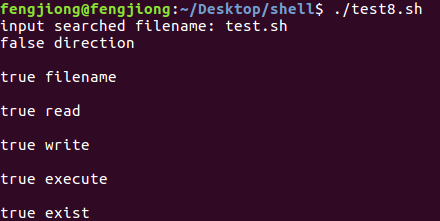


## 4、shell脚本附带选项（重点）

问题描述：在`linux shell`中如何处理`tail -10 access.log`这样的命令行选项？

步骤：

​     调用`tail`指令

​     **系统把后续选项传递给`tail`**

​     `Tail`先去打开指定的文件

​     取出最后`10`行


`#./test.sh a b c`

接收：

在脚本中可以用`“$1”`来表示`a`，`“$2”`来表示`b`，以此类推。

测试：编写test14.sh，传递a，b，c，输出其值

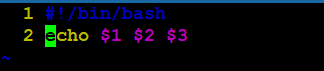


