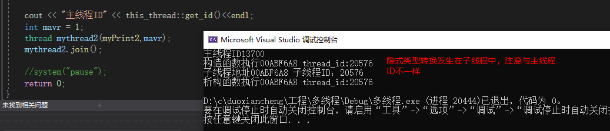

# 一. 并发基本概念及实现，进程，线程基本概念

## 1.并发、进程、线程的基本概念和综述

并发，线程必须要掌握

### （1）并发

两个或者更多的任务（独立的活动）同时发生：一个程序同时执行多个独立的任务；

单核CPU：某一个时刻只能执行一个任务，操作系统进行调度，每秒钟进行所谓的“任务切换”（**上下文切换**）。**并发假象**，这切换有时间开销，比如操作系统需要保存你切换时的各种状态，比如存到寄存器的数据。

多核CPU：能够实现真正的并行执行多个任务（硬件并发）。


抢夺CPU时间片。

### （2）可执行程序

磁盘上的一个文件，win下：.exe的，linux下：有执行权限的文件。

### （3）进程

进程，就是一个可执行程序的 运行

### （4）线程

每个进程（执行起来的可执行程序），都有一个主线程，并且这个主线程是为一个，一个进程只能有一个主线程。

但你执行一个可执行程序，主线程就启动起来了。

运行程序的时候，是进程的主线程来调用main函数的代码。

线程是一个代码执行的通路。


除了主线程之外，我们可以创建其他线程，去别的地方。

每创建一个新线程，我们可以在同一时刻，执行不同的事情。

线程不是越多越好，每一个线程都需要一个独立的堆栈空间（1M），线程之间切换要保存很多中间状态，切换回耗费本该属于程序运行的时间。


### （5）学习心得

## 2.并发的实现方法

多个进程实现并发

一个进程内多个线程实现并发

### （1）多进程并发

进程间通信：

一台电脑：文件，管道，消息队列，共享内存；

不通电脑：socket通信技术；

### （2）多线程并发

单个进程创建了多个线程。

线程是一个轻量级的进程，每个线程都有自己独立的运行路径；一个进程中的所有线程共享空间（共享内存）；**全局变量**，**引用**，**指针**，都可以在线程之间传递，所以使用多线程开销远远小于多进程。

共享内存带来的问题：数据一致性，线程A和线程B同时访问同一块内存

### （3）总结

- 线程启动更快
- 系统资源开销更小，执行速度更快

## 3.C++11新标准库


# 二、线程启动、结束、创建线程

## 1.范例演示线程运行的开始

- 程序运行起来，生成一个进程，该进程所属的主线程开始自动运行；当主线程从main（）函数返回，则整个进程执行完毕
- 主线程从main（）开始执行，那么我们自己创建的线程，也需要从一个函数开始运行（初始函数），一旦这个函数运行完毕，线程也结束运行
- 整个进程是否执行完毕的标志是：主线程是否执行完，如果主线程执行完毕了，就代表整个进程执行完毕了，此时如果其他子线程还没有执行完，也会被强行终止【此条有例外，以后会解释】

### （1）普通函数创建线程

```c++
#include <iostream>
#include<thread>
#include<string>

using namespace std;

void myprint() {
    cout << "子线程----" << endl;

    cout << "我的线程结束了" << endl;
}

int main()
{
    std::cout << "Hello World!\n";
    //(1)创建了线程，线程执行起点（入口）是myPrint；(2)执行线程
    thread test1(myprint);
    
	//(2)阻塞主线程并等待myPrint执行完，当myPrint执行完毕，join()就执行完毕，主线程继续往下执行
	//join意为汇合，子线程和主线程回合
    test1.join();
	//test1.detach();
    cout << "主线程结束了" << endl;
    return 0;
}
```


(3)传统多线程程序中，主线程要等待子线程执行完毕，然后自己才能向下执行 detach:分离，主线程不再与子线程汇合，不再等待子线程 

detach后，子线程和主线程失去关联，驻留在后台，由C++运行时库接管 （**守护线程**）myThread.detach();


​	(4)joinable()判断是否可以成功使用join()或者detach() 

如果返回true，证明可以调用join()或者detach() 

如果返回false，证明调用过join()或者detach()，join()和detach()都不能再调用了

### （2）使用类对象创建一线程

后期可以传入参数，这里先不写。。

```c++
#include <iostream>
#include<thread>
#include<string>

using namespace std;

class MM {
public:
    MM(int &i):m_i(i){
        cout << "MM构造函数被执行" << endl;
    }  
    MM(const MM &mm) :m_i(mm.m_i) {
        cout << "MM拷贝构造函数函数被执行" << endl;
    }
    ~MM()
    {
        cout << "~MM析构函数函数被执行" << endl;
    }
    void operator()() {
        cout << "我的线程operator（）开始执行了" << endl;

        cout << "mi 1的值为：" << m_i << endl;
        cout << "mi 2的值为：" << m_i << endl;
        cout << "mi 3的值为：" << m_i << endl;
        cout << "mi 4的值为：" << m_i << endl;
        cout << "mi 5的值为：" << m_i << endl;
        // ***
        cout << "我的线程operator（）执行完毕了" << endl;
    }
public:
    int& m_i;
};

int main()
{
    int num = 5;
    MM mm1(num);
    thread test2(mm1);
    test2.detach();
	// test2.join();
    cout << "主线程结束了" << endl;
    return 0;
}
```

传入**引用**之后，在类中不会拷贝这个值，如果使用**detach**，子线程与主线程分类，（他们各自执行各自的），当主进程结束时，这个变量就会被释放掉，导致程序出现bug，所以这里我们不能够传入引用（如果要用detach的时候）。

**注意**

还有一个问题：这里的`thread test2(mm1)`，这个`mm1`这也是在主线程中创建的，那么当主线程结束时,这里会有问题吗？答案是不会有问题，当执行创建线程的时候，会对当前的类对象进行一次拷贝（可以发现调用了拷贝构造函数）。

**对象是被复制到线程中的。**

所以这边不会有一个bug


### （3）使用`lambda`表达式创建线程

`lambda`表达式返回一个函数指针，是一个可以被调用的对象，可以作为线程创建的参数。

```c++
//main函数中
auto lambdaThread = [] {
		cout << "我的线程开始执行了" << endl;
		//-------------
		//-------------
		cout << "我的线程开始执行了" << endl;
	};

	thread myThread(lambdaThread);
	myThread.join();

```

### （4）类的成员函数作为线程的入口地址


```c++
class Data_
{
public:
    void GetMsg(){}
    void SaveMsh(){}
};
//main函数里
    Data_ s;
    //第一个&意思是取址，第二个&意思是引用，相当于std::ref(s)
    //thread oneobj(&Data_::SaveMsh,s)传值也是可以的
    //在其他的构造函数中&obj是不会代表引用的，会被当成取地址
    //调用方式：对象成员函数地址，类实例，[成员函数参数]
	//第二个参数可以传递对象s，也可以传递引用std::ref(s)或&s
	//传递s，会调用拷贝构造函数在子线程中生成一个新的对象
	//传递&，子线程中还是用的原来的对象，所以就不能detach，因为主线程运行完毕会把该对象释放掉
    thread oneobj(&Data_::SaveMsh,&s);
    thread twoobj(&Data_::GetMsg,&s);
    oneobj.join();
    twoobj.join();

```


### （5）智能指针作为线程的入口地址


# 三、线程传参详解，detach（）大坑，成员函数做线程函数

## **1.传递临时对象作为线程参数**

### （1）要避免的陷阱1：

这里的函数的参数为：引用整形 `i` ，以及一个`char*` 指针

当我们使用join的时候，主线程等待子线程结束，然后主线程再结束，这样的情况下，这样的传参就没有什么问题，程序就可以正常执行；

如果使用detach后，主程序退出，在主函数中所申请的临时变量就会被销毁，这样就会有问题。

```c++
#include<iostream>
#include<thread>
#include<string>

using namespace std;

void printD(const int &i,char *mystring) {
	cout << i << endl;			// 分析可得 i 并不是mvar的引用 这是一个值传递，
								// 即使使用了detach，这个值也是安全的，在主线程结束后 并没有被销毁。
	cout << mystring << endl;
	return;
}

int main() {

	int mvar = 1;
	int& mvary = mvar;
	char mybuf[] = "this is a string";
	string str = "this is a string";
	thread mythread1(printD, mvar, mybuf);
    
	mythread1.detach();


	cout << "主线程结束" << endl;
	system("pause");
	return 0;
}
```


首先看传递引用的情况：


我们可以看到`mvar`和`mvary`的地址一样，这是因为`mvary`是`mavr`的引用，


进入线程函数中，虽然传递的是引用，但是我们发现，`i`的地址与`mavr`的地址不一样，这是对值进行了一次复制。

所以 我们姑且可以任务传递引用是没有问题的，但是在类中，还是不能传引用。

- ​	`i`不是`mvar`真正的引用，实际上值传递，即使主线程运行完毕了，子线程用`i`仍然是安全的，但仍不推荐传递引用 ，推荐改为`const int i`

再看传递指针的情况：

主函数中`mubuf`数组的地址：


线程函数中形参`mystring`的地址为：


我们可以看出这两个地址是一样的，如果使用`detach`，主线程退出之后，临时变量就会被销毁，这样程序就产生了`bug`。

### （2）要避免的陷阱2：

简单的把`char*`转为`const string`，还不是绝对的安全。

推荐先创建一个临时对象`thread myThread(myPrint, mvar, string(mybuf));`就绝对安全了。。。。

这里不要使用隐式类型转换，要先构造出一个临时变量，作为线程函数传递进去。

```c++
#include <iostream>
#include <thread>
#include <string>
using namespace std;

void myPrint(const int i, const string& pmybuf)
{
	cout << i << endl;
	cout << pmybuf << endl;
}

int main()
{
	int mvar = 1;
	int& mvary = mvar;
	char mybuf[] = "this is a test";
	//如果detach了，这样仍然是不安全的
	//因为存在主线程运行完了，mybuf被回收了，系统采用mybuf隐式类型转换成string
	//推荐先创建一个临时对象thread myThread(myPrint, mvar, string(mybuf));就绝对安全了。。。。
	thread myThread(myPrint, mvar, mybuf);
	myThread.join();
	//myThread.detach();

	cout << "Hello World!" << endl;
}

```


### （3）总结

- 如果传递`int`这种简单类型，推荐使用值传递，不要用引用
- 如果传递类对象，避免使用**隐式类型转换**，全部都是创建线程这一行就创建出临时对象，然后在函数参数里，用引用来接，否则还会创建出一个对象
- 终极结论：建议不使用`detach`


## 2.临时对象作为线程参数继续讲

### （1）线程ID的概念

- id是个数字，每个线程（不管是主线程还是子线程）实际上都对应着一个数字，而且每个线程对应的这个数字都不一样
- 线程id可以用C++标准库里的函数来获取。`std::this_thread::get_id()`来获取


### （2）传入类对象作为线程参数


```c++
#include<iostream>
#include<thread>
#include<string>

using namespace std;

class A {
public:
	int m_i;
	A(int i) :m_i(i) { cout << "构造函数执行" << this<<" thread_id:" <<this_thread::get_id()<< endl; }
	A(const A& a) :m_i(a.m_i) { cout << "拷贝构造函数执行" << this<< " thread_id:" << this_thread::get_id()<<endl; }
	~A()
	{
		cout << "析构函数执行" << this<< " thread_id:" << this_thread::get_id()<<endl;
	}
};

void myPrint2(const A& pmybuf) {

	cout << "子线程地址" << &pmybuf<<" ";

	cout << "子线程ID：" << this_thread::get_id() << endl;
}

int main() {

	cout << "主线程ID" << this_thread::get_id()<<endl;
	int mavr = 1;
	thread mythread2(myPrint2,mavr);
	mythread2.join();

	return 0;
}
```


​	`thread mythread2(myPrint2,mavr);`注意这一句，发生传入线程函数将发生**隐式类型转换**

执行结果如下图所示：.......这个构造函数发生在子线程中，这就很危险。如果使用detach，可能会发生主线程已经结束了，这个构造还没有开始（是利用主线程中的局部变量进行构造），这就会发生`bug`。




`thread mythread2(myPrint2,A(mavr));`采用临时变量传递，执行结果如下图所示：

执行了一次构造函数，拷贝构造函数。传入线程参数内的是是**拷贝出来的对象**，所以在线程函数内部修改内成员函数值，也不会影响主线程内的类对象成员值，这个可以做一个验证。因为它们 **类对象** 的地址不一样。


```c++
	//myPrint(const A& pmybuf)中引用不能去掉，如果去掉会多创建一个对象
	//const也不能去掉，去掉会出错
	//即使是传递的const引用，但在子线程中还是会调用拷贝构造函数构造一个新的对象，
	//所以在子线程中修改m_i的值不会影响到主线程
	//如果希望子线程中修改m_i的值影响到主线程，可以用thread myThread(myPrint, std::ref(myObj));
	//这样const就是真的引用了，myPrint定义中的const就可以去掉了，类A定义中的mutable也可以去掉了

```


使用`std::ref`结果


### （3）传入智能指针作为线程参数


```c++
#include <iostream>
#include <thread>
#include <memory>
using namespace std;

void myPrint(unique_ptr<int> psd)
{
	cout << "thread = " << std::this_thread::get_id() << endl;
}

int main()
{
	unique_ptr<int> myp(new int(10));
	//独占式指针只能通过std::move()才可以传递给另一个指针
	//传递后up就指向空，新的ptn指向原来的内存
	//所以这时就不能用detach了，因为如果主线程先执行完，ptn指向的对象就被释放了
	thread myThread(myPrint, std::move(myp));
	myThread.join();
	//myThread.detach();

	return 0;
}
```


```c++
//独占式指针只能通过std::move()才可以传递给另一个指针
//传递后up就指向空，新的ptn指向原来的内存
//所以这时就不能用detach了，因为如果主线程先执行完，ptn指向的对象就被释放了
```


主线程`myp`智能指针值为空


​	所以这时就不能用`detach`了，因为如果主线程先执行完，`myp`指向的对象就被释放了


### （4）类成员函数指针作为线程参数


```c++
#include<iostream>
#include<thread>
#include<string>

using namespace std;

class A {
public:
	mutable int m_i;
	A(int i) :m_i(i) { cout << "构造函数执行" << this<<" thread_id:" <<this_thread::get_id()<< endl; }
	A(const A& a) :m_i(a.m_i) { cout << "拷贝构造函数执行" << this<< " thread_id:" << this_thread::get_id()<<endl; }
	~A()
	{
		cout << "析构函数执行" << this<< " thread_id:" << this_thread::get_id()<<endl;
	}
	void thread_work(int a) {
		cout << "a = " << a << endl;
		cout << "子线程thread_work执行:" << this<<"  线程ID:"<<this_thread::get_id() << endl;
	}
};

int main() {

	A myobj(10);
	thread mythread4(&A::thread_work, myobj, 100);
    //thread mythread4(&A::thread_work, std::ref(myobj), 100);  // 真引用
	mythread4.join();
	
	return 0;
}
```

​	`thread mythread4(&A::thread_work, myobj, 100);`注意这边传入线程函数是一个类对象，会调用拷贝构造函数，这个时候使用`detach`就是安全的，


`thread mythread4(&A::thread_work, std::ref(myobj), 100);` 使用 `std::ref`,传递真引用，这个时候使用`detach`不安全

注意这个时候`&myobj`与`std::ref(myobj)`效果相同，只能用`join`


# 四、创建多个线程，数据共享问题分析，案例代码

## 1.创建和等待多个线程


```c++
#include<iostream>
#include<thread>
#include<vector>

using namespace std;

void myPrint(int num) { // 线程入口函数

	cout << "子线程开始执行,线程编号: " << num << endl;

	cout << "子线程结束执行,线程编号: " << num << endl;
}


int main() {

	vector<thread> mythread;

	for (int i = 0; i < 10; i++) {
		mythread.push_back(thread(myPrint, i));
	}

	for (auto iter = mythread.begin(); iter != mythread.end(); iter++) {
		iter->join();
	}
	cout << "主线程结束" << endl;

	return 0;
}
```

- 把thread对象放入到容器中管理，看起来像个**thread对象数组**，对一次创建大量的线程并对大量线程进行管理有好处
- 多个线程执行顺序是乱的，跟**操作系统内部对线程的运行调度机制**有关


## 2.数据共享问题分析

### （1）只读的数据


```c++
#include<iostream>
#include<thread>
#include<vector>

using namespace std;

vector<int> gv{ 1 };

void myPrint(int num) { // 线程入口函数

	//cout << "子线程开始执行,线程编号: " << num << endl;

	//cout << "子线程结束执行,线程编号: " << num << endl;

	cout << "线程ID: " << this_thread::get_id() <<"  gv的值："<<gv[0] << endl;  //每个线程都去读gv的值
	return;
}


int main() {

	vector<thread> mythread;

	for (int i = 0; i < 10; i++) {
		mythread.push_back(thread(myPrint, i));
	}

	for (auto iter = mythread.begin(); iter != mythread.end(); iter++) {
		iter->join();
	}
	cout << "主线程结束" << endl;

	//2.1只读的数据

	return 0;
}
```

- 是安全稳定的


### （2）读写数据


- 若不加处理，就会出错
- 最简单的防止崩溃方法：读的时候不能写，写的时候不能读。
- 写的动作分10小步，由于任务切换，导致各种诡异的事情发生（最可能的还是崩溃）


## 3.共享数据保护案例代码

案例：网络游戏服务器，两个自己创建的线程，一个线程收集玩家的命令（数字），并且将命令写到一个队列中；

​																				另一个线程读取玩家命令，从队列中取出，进行解析。


多线程解决数据共享问题，引入一个**“互斥量”**的概念（读的时候不能写，写的时候不能读）。


```c++
#include<iostream>
#include<thread>
#include<vector>
#include<list>

using namespace std;

class A {

public:
	void inMsgReciveQue() {
		for (int i = 0; i < 1000; i++) {
			cout << "inMsgReciveQue: " << i << endl;
			msgReciveque.push_back(i);
		}
	}

	void outMsgReciveQue(){
		for (int i = 0; i < 1000; i++) {
			if (msgReciveque.empty()) {
				cout << "消息队列为空,命令：" << i << endl;
			}
			else
			{
				int com = msgReciveque.front();  // 取元素
				msgReciveque.pop_front();		// 消除
			}
		}
	}

private:
	list<int> msgReciveque;		// 保护共享数据
};


int main() {

	//2.2读写的数据

	A myobj;
	thread mythread_out(&A::outMsgReciveQue, &myobj);	// 取数据
	thread mythread_in(&A::inMsgReciveQue, &myobj);		// 写数据

	mythread_out.join();
	mythread_in.join();

	return 0;
}
```


# 五、互斥量概念、用法、死锁演示及解决详解

## 1.互斥量（mutex）的基本概念

- 互斥量就是个类对象，可以理解为一把锁，多个线程尝试用lock()成员函数来加锁，只有一个线程能锁定成功，如果没有锁成功，那么流程将卡在lock()这里不断尝试去锁定。
- 互斥量使用要小心，保护数据不多也不少，少了达不到效果，多了影响效率。


## 2.互斥量的用法

```c++
#include<iostream>
#include<thread>
#include<vector>
#include<list>
#include<mutex>

using namespace std;

class A {

public:
	void inMsgReciveQue() {
		for (int i = 0; i < 1000; i++) {
			cout << "inMsgReciveQue: " << i << endl;
			my_mutex.lock();
			msgReciveque.push_back(i);
			my_mutex.unlock();
		}
	}

	bool outMagLULPro(int& command) {
		my_mutex.lock();
		if (!msgReciveque.empty()) {
			int com = msgReciveque.front();  // 取元素
			msgReciveque.pop_front();		// 消除
			my_mutex.unlock();
			return true;
		}
		my_mutex.unlock();
		return false;
	}

	void outMsgReciveQue(){
		for (int i = 0; i < 1000; i++) {
			bool result = outMagLULPro(i);
			if (result == true) {
				cout << "outMagLULPro(),从队列中取出一个元素" << endl;
			}
			else {
				cout << "outMagLULPro(),执行，但队列为空" << endl;
			}
		}
	}

private:
	list<int> msgReciveque;
	mutex my_mutex;
};

int main() {

	A myobj;
	thread mythread_out(&A::outMsgReciveQue, &myobj);
	thread mythread_in(&A::inMsgReciveQue, &myobj);

	mythread_out.join();
	mythread_in.join();

	return 0;
}
```

### （1）lock()，unlock()

步骤：

- 1.`lock()`，

- 2.操作共享数据，

- 3.`unlock()`。

  `lock()`和`unlock()`要成对使用

### （2）lock_guard类模板

`lock_guard<mutex> sbguard(myMutex);`    取代  `lock()`和`unlock()`

`lock_guard`构造函数执行了`mutex::lock()`;在作用域结束时，调用析构函数，执行`mutex::unlock()`

```c++
#include<iostream>
#include<thread>
#include<vector>
#include<list>
#include<mutex>

class A {

public:
	void inMsgReciveQue() {
		for (int i = 0; i < 1000; i++) {
			
			//my_mutex.lock();
			cout << "inMsgReciveQue: " << i << endl;
			{
				lock_guard<mutex> sbguard(my_mutex);
				
				msgReciveque.push_back(i);
			}

			//my_mutex.unlock();
		}
	}

	bool outMagLULPro(int& command) {
		lock_guard<mutex> sbguard(my_mutex);		//  lock_guard 构造函数里面 进行lock，析构函数 执行unlock
		//my_mutex.lock();
		if (!msgReciveque.empty()) {
			int com = msgReciveque.front();  // 取元素
			msgReciveque.pop_front();		// 消除
			//my_mutex.unlock();
			return true;
		}
		//my_mutex.unlock();
		return false;
	}

	void outMsgReciveQue(){
		for (int i = 0; i < 1000; i++) {
			bool result = outMagLULPro(i);
			if (result == true) {
				cout << "outMagLULPro(),从队列中取出一个元素" << endl;
			}
			else {
				cout << "outMagLULPro(),执行，但队列为空" << endl;
			}
		}
	}

private:
	list<int> msgReciveque;
	mutex my_mutex;				// 一个互斥量就是 一把锁
};


int main() {

	A myobj;
	thread mythread_out(&A::outMsgReciveQue, &myobj);
	thread mythread_in(&A::inMsgReciveQue, &myobj);

	mythread_out.join();
	mythread_in.join();

	return 0;
}
```

## 3.死锁


### （1）死锁演示


```c++
#include<iostream>
#include<thread>
#include<vector>
#include<list>
#include<mutex>

using namespace std;

class A {

public:
	void inMsgReciveQue() {
		for (int i = 0; i < 1000; i++) {
			
			//my_mutex.lock();
			cout << "inMsgReciveQue: " << i << endl;
			{
				//lock_guard<mutex> sbguard(my_mutex);
				my_mutex1.lock();
				my_mutex2.lock();
				msgReciveque.push_back(i);
				my_mutex2.unlock();
				my_mutex1.unlock();

			}

			//my_mutex.unlock();
		}
	}

	bool outMagLULPro(int& command) {
		//lock_guard<mutex> sbguard(my_mutex);		//  lock_guard 构造函数里面 进行lock，析构函数 执行unlock
		my_mutex2.lock();
		my_mutex1.lock();
		if (!msgReciveque.empty()) {
			int com = msgReciveque.front();  // 取元素
			msgReciveque.pop_front();		// 消除
			my_mutex1.unlock();
			my_mutex2.unlock();
			return true;
		}
		//my_mutex.unlock();
		my_mutex1.unlock();
		my_mutex2.unlock();
		return false;
	}

	void outMsgReciveQue(){
		for (int i = 0; i < 1000; i++) {
			bool result = outMagLULPro(i);
			if (result == true) {
				cout << "outMagLULPro(),从队列中取出一个元素" << endl;
			}
			else {
				cout << "outMagLULPro(),执行，但队列为空" << endl;
			}
		}
	}

private:
	list<int> msgReciveque;
	mutex my_mutex1;			// 需要两个互斥量
	mutex my_mutex2;
};

int main() {
    
	A myobj;
	thread mythread_out(&A::outMsgReciveQue, &myobj);
	thread mythread_in(&A::inMsgReciveQue, &myobj);

	mythread_out.join();
	mythread_in.join();

	return 0;
}
```

死锁至少有两个互斥量mutex1，mutex2。

- a.线程A执行时，这个线程先锁mutex1，并且锁成功了，然后去锁mutex2的时候，出现了上下文切换。
- b.线程B执行，这个线程先锁mutex2，因为mutex2没有被锁，即mutex2可以被锁成功，然后线程B要去锁mutex1.
- c.此时，死锁产生了，A锁着mutex1，需要锁mutex2，B锁着mutex2，需要锁mutex1，两个线程没办法继续运行下去。。。

### （2）解决方式

只要保证两个互斥量的顺序一致，就不会发生死锁。


修改上述代码，保证两个互斥量顺序保持一致，就不会发生死锁

### （3）std::lock()函数模板

`std::lock(mutex1,mutex2……);` 一次锁定多个互斥量（一般这种情况很少），用于处理多个互斥量。

如果互斥量中一个没锁住，它就等着，等所有互斥量都锁住，才能继续执行。如果有一个没锁住，就会把已经锁住的释放掉

（**要么互斥量都锁住，要么都没锁住，防止死锁**）

能够处理多个互斥量。


```c++
#include<iostream>
#include<thread>
#include<vector>
#include<list>
#include<mutex>

using namespace std;

class A {

public:
	void inMsgReciveQue() {
		for (int i = 0; i < 1000; i++) {
			
			//my_mutex.lock();
			cout << "inMsgReciveQue: " << i << endl;
			{
				//lock_guard<mutex> sbguard(my_mutex);
				//my_mutex1.lock();
				//my_mutex2.lock();
				lock(my_mutex1, my_mutex2);
				msgReciveque.push_back(i);
				my_mutex2.unlock();
				my_mutex1.unlock();

			}

			//my_mutex.unlock();
		}
	}

	bool outMagLULPro(int& command) {
		//lock_guard<mutex> sbguard(my_mutex);		//  lock_guard 构造函数里面 进行lock，析构函数 执行unlock
		//my_mutex1.lock();
		//my_mutex2.lock();
		lock(my_mutex1, my_mutex2);
		if (!msgReciveque.empty()) {
			int com = msgReciveque.front();  // 取元素
			msgReciveque.pop_front();		// 消除
			my_mutex1.unlock();
			my_mutex2.unlock();
			return true;
		}
		//my_mutex.unlock();
		my_mutex1.unlock();
		my_mutex2.unlock();
		return false;
	}

	void outMsgReciveQue(){
		for (int i = 0; i < 1000; i++) {
			bool result = outMagLULPro(i);
			if (result == true) {
				cout << "outMagLULPro(),从队列中取出一个元素" << endl;
			}
			else {
				cout << "outMagLULPro(),执行，但队列为空" << endl;
			}
		}
	}

private:
	list<int> msgReciveque;
	mutex my_mutex1;
	mutex my_mutex2;
};


int main() {


	A myobj;
	thread mythread_out(&A::outMsgReciveQue, &myobj);
	thread mythread_in(&A::inMsgReciveQue, &myobj);

	mythread_out.join();
	mythread_in.join();

	return 0;
}
```


这样操作，还是需要自己去手动 `unlock`，使用不方便。

### （4）std::lock_guard的std::adopt_lock参数

- `std::lock_guardstd::mutex my_guard(my_mutex,std::adopt_lock);`
- 加入`adopt_lock`后，在调用`lock_guard`的构造函数时，不再进行`lock();`
- `adopt_guard`为结构体对象，起一个标记作用，表示这个互斥量已经`lock()`，不需要在`lock()`。

```c++
class A {

public:
	void inMsgReciveQue() {
		for (int i = 0; i < 1000; i++) {
			
			//my_mutex.lock();
			cout << "inMsgReciveQue: " << i << endl;
			{
				//lock_guard<mutex> sbguard(my_mutex);
				//my_mutex1.lock();
				//my_mutex2.lock();
				lock(my_mutex1, my_mutex2);
				lock_guard<mutex> suguard1(my_mutex1, adopt_lock);
				lock_guard<mutex> suguard2(my_mutex2, adopt_lock);
				msgReciveque.push_back(i);
				//my_mutex2.unlock();
				//my_mutex1.unlock();

			}
			//my_mutex.unlock();
		}
	}

	bool outMagLULPro(int& command) {
		//lock_guard<mutex> sbguard(my_mutex);		//  lock_guard 构造函数里面 进行lock，析构函数 执行unlock
		//my_mutex1.lock();
		//my_mutex2.lock();
		lock(my_mutex1, my_mutex2);
		lock_guard<mutex> suguard1(my_mutex1, adopt_lock);
		lock_guard<mutex> suguard2(my_mutex2, adopt_lock);
		if (!msgReciveque.empty()) {
			int com = msgReciveque.front();  // 取元素
			msgReciveque.pop_front();		// 消除
			//my_mutex1.unlock();
			//my_mutex2.unlock();
			return true;
		}
		//my_mutex.unlock();
		//my_mutex1.unlock();
		//my_mutex2.unlock();
		return false;
	}

	void outMsgReciveQue(){
		for (int i = 0; i < 1000; i++) {
			bool result = outMagLULPro(i);
			if (result == true) {
				cout << "outMagLULPro(),从队列中取出一个元素" << endl;
			}
			else {
				cout << "outMagLULPro(),执行，但队列为空" << endl;
			}
		}
	}

private:
	list<int> msgReciveque;
	mutex my_mutex1;
	mutex my_mutex2;
};
```


lambda表达式打印东西

```c++
[]() {cout << "I love china" << endl; }();
```

# 六、unique_lock（类模板）详解

## **1.unique_lock取代lock_guard**

`unique_lock`比`lock_guard`灵活很多（多出来很多用法），效率差一点，内存多一点。
`unique_lock<mutex>  myUniLock(myMutex)`;

下面只展示类内的相关代码：

```c++
class AA {

public:
	void inMsgReciveQue() {
		for (int i = 0; i < 1000; i++) {
			cout << "inMsgReciveQue: " << i << endl;
			{
				unique_lock<mutex> myguard(my_mutex1);
				msgReciveque.push_back(i);
			}
		}
	}

	bool outMagLULPro(int& command) {
		
		unique_lock<mutex> myguard(my_mutex1);

		if (!msgReciveque.empty()) {
			int com = msgReciveque.front();  // 取元素
			msgReciveque.pop_front();		// 消除

			return true;
		}
		return false;
	}

	void outMsgReciveQue() {
		for (int i = 0; i < 1000; i++) {
			bool result = outMagLULPro(i);
			if (result == true) {
				cout << "outMagLULPro(),从队列中取出一个元素" << endl;
			}
			else {
				cout << "outMagLULPro(),执行，但队列为空" << endl;
			}
		}
	}

private:
	list<int> msgReciveque;
	mutex my_mutex1;
	mutex my_mutex2;
};
```

## **2.unique_lock的第二个参数**

### （1）std::adopt_lock：

- 表示这个互斥量已经被`lock()`，即不需要在构造函数中`lock`这个互斥量了。
- 前提：必须提前`lock`
- `lock_guard`中也可以用这个参数


### （2）std::try_to_lock：

尝试用`mutex`的`lock()`去锁定这个`mutex`，但如果没有锁定成功，会立即返回，不会阻塞在那里；

使用`try_to_lock`的原因是防止其他的线程锁定`mutex`太长时间，导致本线程一直阻塞在`lock`这个地方（因为本线程一直拿不到锁，一直堵塞在`lock`那个地方）。

前提：不能提前`lock()`;

`owns_locks()`方法判断是否拿到锁，如拿到返回true

```c++
class AA4 {

public:
	void inMsgReciveQue() {
		for (int i = 0; i < 1000; i++) {

		
			//cout << "inMsgReciveQue: " << i << endl;
			{
				//my_mutex1.lock();
				unique_lock<mutex> myguard(my_mutex1, try_to_lock);
				if (myguard.owns_lock()) {
					cout << "尝试拿锁成功" << endl;
					msgReciveque.push_back(i);
				}
				else
				{
					cout << "尝试拿锁失败" << endl;
				}
				//this_thread::sleep_for(std::chrono::seconds(20));		//	休息 20s

			}
		}
	}

	bool outMagLULPro(int& command) {
		
		lock_guard<mutex> myguard(my_mutex1);
		//my_mutex1.lock();
		this_thread::sleep_for(std::chrono::milliseconds(20000));		//	休息 20s

		if (!msgReciveque.empty()) {
			command = msgReciveque.front();  // 取元素
			msgReciveque.pop_front();		// 消除

			return true;
		}
		return false;
	}

	void outMsgReciveQue() {
		int command = 0;
		for (int i = 0; i < 1000; i++) {
			bool result = outMagLULPro(command);
			if (result == true) {
				cout << "outMagLULPro(),从队列中取出一个元素: " <<command<< endl;
			}
			else {
				cout << "outMagLULPro(),执行，但队列为空" << endl;
			}
		}
	}

private:
	list<int> msgReciveque;
	mutex my_mutex1;
	mutex my_mutex2;
};
```


尝试去拿锁，拿不到锁，直接返回，不会卡死在`lock`那边


### （3）std::defer_lock：

- 如果没有第二个参数就对`mutex`进行加锁，加上`defer_lock`是始化了一个没有加锁的`mutex`
- 不给它加锁的目的是以后可以调用`unique_lock`的一些方法
- 前提：不能提前`lock`


### 3.unique_lock的成员函数

### （1）lock 加锁


不用自己`unlock()`;


### （2）unlock 解锁

```c++
class AA4 {

public:
	void inMsgReciveQue() {
		for (int i = 0; i < 1000; i++) {

		
			cout << "inMsgReciveQue: " << i << endl;
			{
				//my_mutex1.lock();
				unique_lock<mutex> myguard(my_mutex1, defer_lock);

				myguard.lock();		// 不用自己unlock
				
				myguard.unlock();

				// 处理非共享代码；  先把锁释放出来 让别的线程能够拿到这个锁

				myguard.lock();

				msgReciveque.push_back(i);
				//this_thread::sleep_for(std::chrono::seconds(20));		//	休息 20s

			}
		}
	}

	bool outMagLULPro(int& command) {
		
		lock_guard<mutex> myguard(my_mutex1);
		//my_mutex1.lock();
		this_thread::sleep_for(std::chrono::milliseconds(200));		//	休息 20s

		if (!msgReciveque.empty()) {
			command = msgReciveque.front();  // 取元素
			msgReciveque.pop_front();		// 消除

			return true;
		}
		return false;
	}

	void outMsgReciveQue() {
		int command = 0;
		for (int i = 0; i < 1000; i++) {
			bool result = outMagLULPro(command);
			if (result == true) {
				cout << "outMagLULPro(),从队列中取出一个元素: " <<command<< endl;
			}
			else {
				cout << "outMagLULPro(),执行，但队列为空" << endl;
			}
		}
	}

private:
	list<int> msgReciveque;
	mutex my_mutex1;
	mutex my_mutex2;
};
```


因为一些非共享代码要处理，可以暂时先`unlock()`，用其他线程把它们处理了，处理完后再`lock()`。


### （3）try_lock 尝试加锁


```c++
class AA4 {

public:
	void inMsgReciveQue() {
		for (int i = 0; i < 1000; i++) {	
			{
				//my_mutex1.lock();
				unique_lock<mutex> myguard(my_mutex1, defer_lock);

				//myguard.lock();		// 不用自己unlock
				
				//myguard.unlock();

				// 处理非共享代码；  先把锁释放出来 让别的线程能够拿到这个锁

				//myguard.lock();
				if (myguard.try_lock() == true) {
					cout << "inMsgReciveQue: " << i << endl;
					msgReciveque.push_back(i);
				}
				else {
					cout << "没拿到锁，干点别的事" << endl;
				}				
				//this_thread::sleep_for(std::chrono::seconds(20));		//	休息 20s
			}
		}
	}

	bool outMagLULPro(int& command) {
		
		lock_guard<mutex> myguard(my_mutex1);
		//my_mutex1.lock();
		this_thread::sleep_for(std::chrono::milliseconds(200));		//	休息 20s

		if (!msgReciveque.empty()) {
			command = msgReciveque.front();  // 取元素
			msgReciveque.pop_front();		// 消除

			return true;
		}
		return false;
	}

	void outMsgReciveQue() {
		int command = 0;
		for (int i = 0; i < 1000; i++) {
			bool result = outMagLULPro(command);
			if (result == true) {
				cout << "outMagLULPro(),从队列中取出一个元素: " <<command<< endl;
			}
			else {
				cout << "outMagLULPro(),执行，但队列为空" << endl;
			}
		}
	}

private:
	list<int> msgReciveque;
	mutex my_mutex1;
	mutex my_mutex2;
};
```


### （4）release()：

`unique_lock<mutex> myUniLock(myMutex)`;相当于把`myMutex`和`myUniLock`绑定在了一起；

`release()`就是解除绑定，返回它所管理的`mutex`对象的指针，并释放所有权

`mutex* ptx  = myUniLock.release()`;所有权由`ptx`接管，如果原来mutex对象处理加锁状态，就需要`ptx`在以后进行解锁了。

`lock`的代码段越少，执行越快，整个程序的运行效率越高。

- a.锁住的代码少，叫做粒度细，执行效率高；
- b.锁住的代码多，叫做粒度粗，执行效率低；


### 4.unique_lock所有权的传递

`unique_lock<mutex>  myUniLock(myMutex)`;把`myMutex`和`myUniLock`绑定在了一起，也就是`myUniLock`拥有`myMutex`的所有权

1. 使用`move`转移

`myUniLock`拥有`myMutex`的所有权，`myUniLock`可以把自己对`myMutex`的所有权转移，但是不能复制。

`unique_lock<mutex>  myUniLock2(std::move(myUniLock))`;

现在`myUniLock2`拥有`myMutex`的所有权。


​	2. 在函数中`return`一个临时变量，即可以实现转移

```c++
unique_lock<mutex> aFunction()
{
    unique_lock<mutex> myUniLock(myMutex);
    //移动构造函数那里讲从函数返回一个局部的unique_lock对象是可以的
    //返回这种局部对象会导致系统生成临时的unique_lock对象，并调用unique_lock的移动构造函数
    return myUniLock;
}
// 然后就可以在外层调用，在sbguard具有对myMutex的所有权
std::unique_lock<std::mutex> sbguard = aFunction();

```

